# 🔄 Ingestion Workflow

This document describes the end-to-end data ingestion flow for the War Room dashboard, using **BG Saxo** as the reference implementation.

---

## Detailed Flowchart (Mermaid)

```mermaid
flowchart TD
    classDef script fill:#f9f,stroke:#333,stroke-width:2px;
    classDef decision fill:#ff9,stroke:#333,stroke-width:2px;
    classDef db fill:#bfb,stroke:#333,stroke-width:2px;
    classDef file fill:#bbf,stroke:#333;

    Start(("🚀 START<br/>run_bgsaxo.bat")) --> Script[/"🐍 ingest_bgsaxo_full.py"/]:::script
    Script --> Detect{{"🔍 Files Found?"}}:::decision
    
    Detect -- No --> End(("❌ Stop"))
    Detect -- Yes --> Split_Flow((("🔀")))

    %% CSV FLOW
    Split_Flow -->|Process CSV| CheckRuleC{{"❓ Rules Exist?"}}:::decision
    CheckRuleC -- No --> AnaC["🧠 analyze_csv_structure.py<br/>(LLM Qwen)"]:::script
    AnaC --> GenRuleC[("📄 csv.rules.json")]:::file
    GenRuleC --> ParseC
    CheckRuleC -- Yes --> ParseC["⚙️ parse_bgsaxo_csv.py<br/>(Local Python Parser)"]:::script
    ParseC -->|Read CSV + Rules| DataC[("📊 Holdings Data")]:::file

    %% PDF FLOW
    Split_Flow -->|Process PDF| CheckRuleP{{"❓ Rules Exist?"}}:::decision
    CheckRuleP -- No --> AnaP["🧠 analyze_pdf_structure.py<br/>(LLM Qwen)"]:::script
    AnaP --> GenRuleP[("📄 pdf.rules.json")]:::file
    GenRuleP --> ParseP
    CheckRuleP -- Yes --> ParseP["⚙️ parse_bgsaxo_dynamic.py<br/>(Local Regex Engine)"]:::script
    ParseP -->|Read PDF + Rules| DataP[("📊 Extracted JSON")]:::file

    %% MERGE & INGEST
    DataC --> SycnPoint((("🔄")))
    DataP --> SycnPoint
    SycnPoint --> CleanDB["🧹 DELETE FROM db<br/>WHERE broker='BG_SAXO'"]:::db
    CleanDB --> InsertH["📥 INSERT Holdings"]:::db
    CleanDB --> InsertT["📥 INSERT Transactions"]:::db
    
    InsertH --> Commit["✅ COMMIT"]:::db
    InsertT --> Commit
    Commit --> Finish(("🏁 DONE"))
```



---

## Step-by-Step

| Step | Action | Script | Output |
|------|--------|--------|--------|
| 1 | **Detect Files** | `ingest_bgsaxo_full.py` | Latest CSV & PDF paths |
| 2 | **Check Rules** | (auto) | If `.rules.json` missing → Step 3 |
| 3 | **LLM Discovery** | `analyze_csv_structure.py` / `analyze_pdf_structure.py` | `.rules.json` (Regex config) |
| 4 | **Parse CSV** | `parse_bgsaxo_csv.py` | Holdings data (Python dict) |
| 5 | **Parse PDF** | `parse_bgsaxo_dynamic.py` | `.extracted.json` |
| 6 | **Clean DB** | SQLAlchemy | Deletes old BG_SAXO records |
| 7 | **Insert Data** | SQLAlchemy | Holdings & Transactions in DB |

---

## Key Design Decisions

1. **LLM is used ONLY for rule discovery** (one-time per file type), not for runtime extraction.
2. **Parsing is 100% deterministic** via Python/Regex and a **unified robust numeric parser** (`utils/parsing.py`), ensuring consistency and speed.
3. **Standardized Naming**: All orchestrators follow `ingest_<broker>_full.py`.
4. **Block-based PDF parsing** handles multi-line transaction records accurately.
5. **ISIN regex is universal** ([A-Z]{2}[A-Z0-9]{9}\d) to capture all countries.

---

## How to Run

```batch
.\run_bgsaxo.bat
```

This will:
- Auto-detect the latest files in `d:\Download\BGSAXO`
- Generate rules if missing
- Parse and ingest to DB
